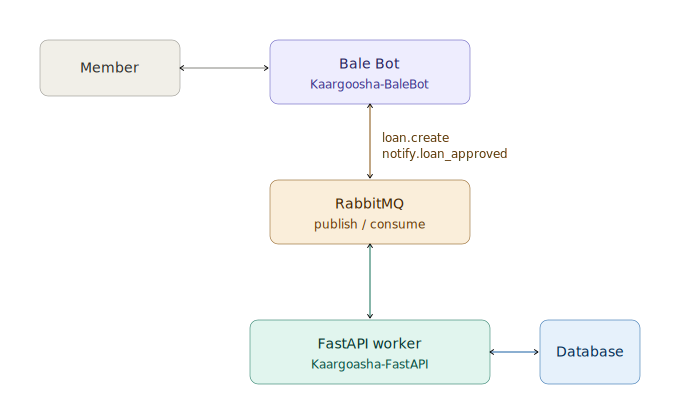
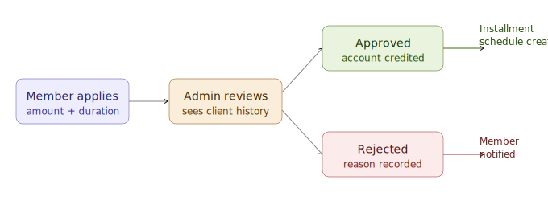

# Kaargoosha

**A family loan fund, digitized.**

A community loan fund — automated, structured, and run entirely through a Bale messenger bot. Members never install an app or visit a website; every interaction happens inside a chat.

---

## What is this?

Kaargoosha turns an informal, trust-based family loan fund into a structured digital platform. A member talks to a bot. The bot talks to a backend service over a message queue. The backend service owns the database, enforces every business rule, and pushes notifications back out. No part of the system is exposed directly to the internet except the bot's connection to the messaging platform.

Built for real families and real trust circles, where loans are backed by relationships, account balances, and a layer of social accountability rather than a credit bureau.

---

## Architecture

This is a microservice project split across two repositories.

| Service | Repository | Responsibility |
|---|---|---|
| Bale Bot | [`Kaargoosha-BaleBot`](https://github.com/danialhedaiat/Kaargoosha-BaleBot) | Everything the member sees — menus, flows, notifications. No business logic, no direct database access. |
| FastAPI worker | [`Kaargoosha-FastAPI`](https://github.com/danialhedaiat/Kaargoosha-FastAPI) | Owns the database, runs every validation and business rule. A background worker — it never serves HTTP requests to members. |



The bot publishes a message — `user.create`, `loan.create`, `deposit.approve`, and so on — onto RabbitMQ and waits for a correlated reply. The FastAPI worker consumes that message, runs the corresponding service logic, and either replies synchronously or, for longer-running outcomes like an admin decision, pushes an asynchronous notification back onto the queue (`notify.loan_approved`, `notify.loan_rejected`) for the bot to deliver to the right chat.

---

## Core features

**User management.** Registration by phone number, with duplicate detection across social platforms — currently Bale, with the schema already prepared for others.

**Roles and permissions.** A genuine role-based access control system rather than a single `is_admin` flag. Roles are composable and carry granular permission codenames such as `loan.create`, `loan.approve`, and `role.assign`. Admins can create roles, assign permissions to them, and grant or revoke roles per user.

**Account wallet.** Every member receives an account the moment they register, starting at a zero balance. Members charge their wallet by submitting payment proof; an admin reviews and approves each deposit before the balance updates.

**Loan application.** A guided, multi-step conversation: amount, then duration, then a confirmation summary, then submission. Admins are notified immediately with one-tap approve or reject controls, the applicant's full loan history, and a required reason on rejection.

**Installment scheduling** *(in progress)*. The moment a loan is approved, a monthly payment schedule is generated automatically, with a configurable grace period before a late fee applies.

**Trust and guarantee system** *(in progress)*. A credit-scoring mechanism that rewards on-time repayment and requires guarantors from members who are new or carry a negative score — because in a family fund, trust is itself a kind of collateral.

**Bank information collection** *(in progress)*. Members register a card or account number once, so an approved loan can be transferred without a separate phone call.

**Admin control center.** A structured admin menu covering role settings and loan management — list, pending, approved, rejected, each filterable by time window — all inline inside the chat.

---

## Loan request lifecycle



A member applies with an amount and a duration. The admin reviews the request alongside the applicant's history and either approves it, which credits the account and generates the installment schedule, or rejects it with a recorded reason, which the member is notified of immediately.

---

## Tech stack

| Layer | Tool |
|---|---|
| Bot framework | `python-telegram-bot`, used against the Bale-compatible API |
| Backend service | `FastAPI` |
| ORM | `SQLAlchemy 2.0`, typed `Mapped` columns |
| Migrations | `Alembic` |
| Message broker | `RabbitMQ` via `pika` |
| Serialization | `msgpack` on the wire, `pydantic` for schema validation |
| Configuration | `pydantic-settings` with a `.env` file per service |

---

## Project structure

**`Kaargoosha-BaleBot`**
```
core/
  main.py                 # BaleBot — handlers, menus, conversation flows
  publisher.py             # BotPublisher — RPC-style RabbitMQ publish/await
  rabbitmq_connection.py
  settings.py
```

**`Kaargoosha-FastAPI`**
```
core/
  app.py                  # FastAPI app instance
  database.py              # SQLAlchemy engine and session factory
  rabbitmq_connection.py
  settings.py
user_management/
  models.py                # UserModel, Role, Permission, UserRole, RolePermission
  schema.py                 # Pydantic schemas
  service.py                 # UserService, RoleService, PermissionService
  consumer.py                 # UserConsumer — RabbitMQ routing
  permissions.py               # Permission codename constants
migrations/                     # Alembic revisions
```

---

## Project status

| Domain | Status |
|---|---|
| User registration and auth | Done |
| Roles and permissions | Done |
| Loan application flow | Done |
| Admin loan notifications | Done |
| Account wallet and eligibility | In progress |
| Bank info collection | In progress |
| Client scoring and guarantors | In progress |
| Installment scheduling | Done |
| Late fee automation | Planned |

Work is tracked in Linear. Every task belongs to a user scenario — no task is created without one.

---

## Getting started

This repository uses Git submodules. Clone with:

```bash
git clone --recurse-submodules https://github.com/danialhedaiat/Kaargoosha.git
```

Each service reads its own `.env` file — see `core/settings.py` in each repository for the required variables (`RABBITMQ_HOST`, `BOT_TOKEN`, `ALEMBIC_DATABASE_URL`, and so on).

```bash
# FastAPI worker
cd Kaargoosha-FastAPI
pip install -r requirements.txt
alembic upgrade head
python run_worker.py

# Bale Bot
cd Kaargoosha-BaleBot
pip install -r requirements.txt
python core/main.py
```

Both services require a running RabbitMQ instance to communicate with each other.

---

## License

MIT © 2026 [Danial Hedaiat](mailto:danialhedaiat@gmail.com)
